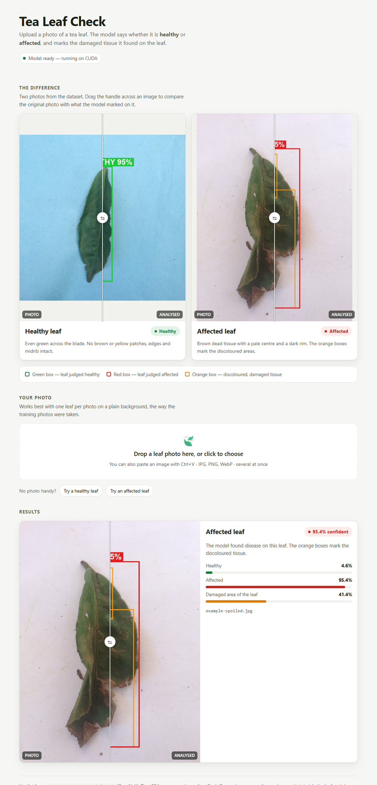

# Tea leaf classifier: healthy vs spoiled

Binary classifier for tea leaf photos. `healthy/` is class **healthy**; `algal leaf/` and
`brown blight/` are merged into class **spoiled**.



## Setup

```
python -m venv .venv
.venv\Scripts\pip install -r requirements.txt --extra-index-url https://download.pytorch.org/whl/cu121
```

The trained weights (`models/tea_leaf_classifier.pt`, 106 MiB) are stored with
[Git LFS](https://git-lfs.com). Install it **before cloning** and the file comes down with the
repository:

```
git lfs install
git clone https://github.com/kowshickj-git/Plant-diease-detection.git
```

If you cloned without Git LFS, `models/tea_leaf_classifier.pt` will be a small text pointer
instead of the model. Install Git LFS and run `git lfs pull` to fetch the real file. You can
also train your own with `train.py` (see [Retrain](#retrain)).

## Web page (easiest: upload a photo in the browser)

```
.venv\Scripts\python app.py
```

Your browser opens on `http://127.0.0.1:8000`. Drop a leaf photo onto the page, click to
pick one, or paste one with Ctrl+V — several at once is fine. Each result shows the verdict,
how confident the model is, the healthy/affected split and, for an affected leaf, how much of
it is damaged. Drag the handle across any image to compare the photo with the model's marks.

The top of the page puts a healthy leaf next to an affected one so the difference is visible
before you upload anything, and the two *Try a …* buttons run a dataset photo if you have no
photo handy.

The page only serves on `127.0.0.1`, so it is reachable from this computer and nowhere else.
It uses Python's built-in HTTP server, so there is nothing extra to install, and the model
loads in the background while the page opens (uploads wait for it). Options:
`--port 8001`, `--no-browser`, `--model path\to\other.pt`. Stop it with Ctrl+C.

## Detect leaves in your own photos (annotated images)

1. Copy the image's location. In Explorer, right-click the image and choose **Copy as path**.
   In VS Code, right-click the file and choose **Copy Path**.
2. Open `detect.py` and paste it into `IMAGE_PATH = r"..."` at the top.
   A folder works too, and any quotes that came with the pasted path are removed.
3. Run `.venv\Scripts\python detect.py`

The result opens on screen and is saved to `test\healthy\` or `test\spoiled\`:
* **Green box, HEALTHY xx%** or **red box, SPOILED xx%**: the leaf and the model's verdict.
* **Orange boxes** (spoiled only): brown, yellow or dead patches found by colour analysis
  inside the leaf, plus the damaged share of the leaf. They show where the damage is;
  the verdict itself comes from the classifier.

You can also pass paths directly: `.venv\Scripts\python detect.py "C:\photos\leaf.jpg" "C:\photos\folder"`.
If `IMAGE_PATH` is left empty (`r""`), the script asks you for a path.

`test\` in this repository holds a few annotated examples, the two contact sheets
(`preview_healthy.jpg` and `preview_spoiled.jpg`, which show all 300 photos at once) and
`results.csv`, which lists the prediction for every photo. Running `detect.py` over the three
dataset folders regenerates the full set. Those photos were used for training, so they show
what the output looks like, not how accurate the model is — the accuracy figures are the
cross-validation results below.

## Plain predictions (no drawing)

```
.venv\Scripts\python predict.py path\to\photo.jpg
.venv\Scripts\python predict.py path\to\folder --csv results.csv
```

Model: `models/tea_leaf_classifier.pt` (ConvNeXt-Tiny, ImageNet-12k pretrained, 384x384 input).
Works best with one leaf per photo on a plain background, as in the training photos.

## Results

5-fold cross-validation grouped by physical leaf (299 photos, 210 distinct leaves).
Every photo is predicted by a model that never saw that leaf.

| Test                                 | Accuracy          | Balanced acc. | ROC AUC |
|--------------------------------------|-------------------|---------------|---------|
| Original photos                      | **100%** (299/299) | 100%          | 1.000   |
| Leaf on the *other* class's paper    | **99.7%** (298/299) | 99.3%         | 1.000   |
| Leaf on plain grey                   | **100%** (299/299) | 100%          | 1.000   |

The single miss is `healthy/UNADJUSTEDNONRAW_thumb_20d.jpg` (p_spoiled 0.53). That leaf has
reddish-brown marks along the midrib, so the label itself is borderline.

EfficientNetV2-S with the same recipe scored lower (98.3% / 95.7% / 97.0%).
The full numbers are in `runs/<arch>/cv_metrics.json`, and per-image predictions are in `oof_predictions.csv`.

## Why the extra steps: the dataset has shortcuts

* **Background colour:** 73 of 74 healthy photos are on blue paper and all 226 diseased
  photos are on white paper. A rule that says "blue border = healthy" scores 100% on the
  original photos and **0%** when backgrounds are swapped. A model trained naively on these
  photos learns that rule.
* **Photo shape:** all 32 square (1024x1024) photos are healthy.
* **Repeat photos:** many leaves were photographed 2-11 times. Random splits put copies of
  the same leaf in both train and validation, which inflates the score.

How the pipeline handles them:
1. `prepare_data.py` cuts each leaf out with GrabCut and strips leftover blue paper from
   the leaf edges. It also groups repeat photos of the same leaf using DINOv2 similarity.
2. `train.py` pastes each leaf onto random backgrounds every epoch (white and blue
   paper equally often for both classes, plus random colours, gradients and textures). It
   also applies rotation, scale, lighting, white-balance and shadow jitter. Photos are
   padded to square, never stretched.
3. Cross-validation keeps every photo of a leaf in the same fold. It reports the swapped-background
   test, which is the one a background-cheating model fails.

Excluded: `healthy/UNADJUSTEDNONRAW_thumb_23c.jpg` is a photo of grass and soil, not a tea leaf.

## Retrain

```
.venv\Scripts\python prepare_data.py                  # segment leaves, group duplicates -> cache/
.venv\Scripts\python train.py cv    --arch convnext_tiny.in12k_ft_in1k_384   # ~15 min on RTX 3050
.venv\Scripts\python train.py final --arch convnext_tiny.in12k_ft_in1k_384   # ~3 min
```

Settings: 30 epochs, AdamW (lr 1e-4 backbone / 1e-3 head, wd 0.05), cosine schedule,
label smoothing 0.1, class- and duplicate-balanced sampling, bf16, flip TTA at inference.

## Limits

* Only 40 distinct healthy leaves, all photographed in one session. The model has seen little
  variety of healthy leaves, so expect lower accuracy on photos taken very differently
  (a leaf still on the bush, several leaves in one frame, very different lighting or camera).
  Adding photos in the conditions where you will use the model is the most effective improvement.
* Confidence tops out around 95% because of label smoothing. Treat anything below ~80% as uncertain.
* The model always answers healthy or spoiled, even for photos with no tea leaf in them.
  The excluded grass-and-soil photo comes out as "spoiled".
* The leaf box and orange damage boxes come from colour segmentation built for a leaf on
  plain paper. On busy backgrounds the leaf box falls back to the whole photo.
